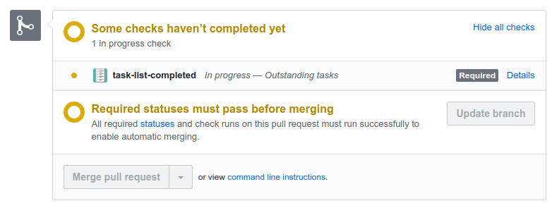
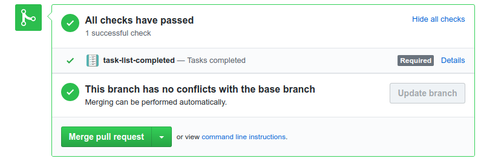
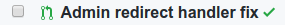
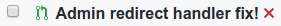

<p align="center"></p>


GitHub - Task list completed PR check
=========================

Install from the Marketplace: https://github.com/marketplace/task-list-completed

Check a pull request body for task lists / checkboxes / tickboxes & make sure they are all completed.
The check will not pass until all task lists have been checked.

**Mark it as a required check to preventing merging the PR until all tasks in a PR have been ticked off.**

You can use this to check manual tests or requirements have been ticked off before the pull request can be merged.

E.g. Say you add some tasks like so
```
- [x] Check the size looks good on the front end
- [ ] Check the image is centered
```

& they display like this to be ticked off as tests:


this will show the check as pending as only 1 of the tasks is completed s (same if none etc.):



Once all tasks are marked off it'll show as completed:




Also when viewing all Pull Requests, you'll see the green tick when all completed:


& an orange dot when still tasks todo:


& if you have other CI tests such as unit tests etc, our pending status will not get in the way of failing tests, they will still show as the red cross:



Find out more about GitHub task lists: https://help.github.com/en/articles/about-task-lists

## Docs

Install & add to the repos you want.

Want to require tasks to be complete before it can be merged?

Inside your GitHub repo > Settings > Branches > Branch protection rules > Add rule > select require checks & require this check to pass.

By default, we mark the check as in_progress until all tasks pass and then it marks it as successful.

## TODO

- [x] ~~unit tests & travis CI~~
- [ ] Submit to https://github.com/probot/probot.github.io/blob/master/.github/app-review-process.md
- [ ] Add config to allow changing from in_progress to completed but with a failure or neutral conclsion if needed -> https://probot.github.io/api/latest/classes/context.html#config
- [ ] Finish docs, e.g. about using a .github/task-list.yml for above

## Contributing

For now, on Glitch you can click to "remix to edit" and then work on your own forked version.
Then if you have ideas to bring over, you can submit an issue to discuss them or a pull request with the code changes.
Thank you.

You can also help support the hosting and development of this project with coffee power:
<a href="https://www.buymeacoffee.com/stilliard" target="_blank"></a>

## Development for main repo

Code previous ran on Glitch, now it's self hosted.
 
For glitch deployments, on the glitch page, click tools > console and then run `git pull origin master && refresh`.
Permission changes would need to be changed in the app on github.

## Security

The code is all here to see & available on the Glitch link below which is also where the service runs.
No data about your user or repo is logged.

If you discover a security issue please email it to myself at andrew@stapps.io and I will get back to you asap. For all other issues or help you can create an issue on this project - Thank you.

## Credits 
- [Probot](https://github.com/probot/probot) - Used to build this project
- [Glitch](https://glitch.com/) - Used as an online editor & to host the service
- [WIP](https://github.com/wip/app) - Inspiration for this project
- [Juliia Osadcha / iconfinder](https://www.iconfinder.com/icons/1790658/checklist_checkmark_clipboard_document_list_tracklist_icon) Icon used for this project

#### About Glitch

This repo was started on Glitch: https://glitch.com/edit/#!/task-list-completed

**Glitch** is the friendly commmunity where you'll build the app of your dreams. Glitch lets you instantly create, remix, edit, and host an app, bot or site, and you can invite collaborators or helpers to simultaneously edit code with you.

Find out more [about Glitch](https://glitch.com/about).
\ ゜o゜)ノ
